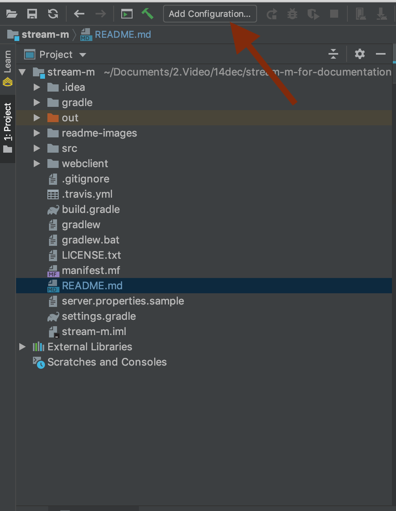
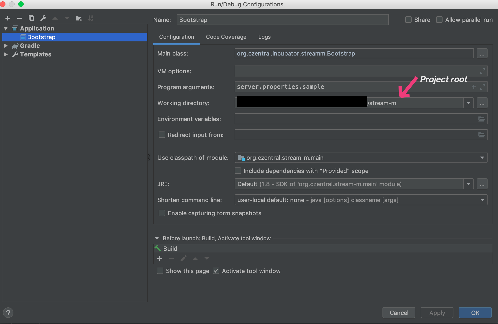

Steps to get going fast with *stream-m* project 
===============

## Clone & Import project 
  1. Git clone the project.
  2. Open *gradle.build* file from the root of the project from IntelliJ IDEA.
  
## Run the project 
  1. After the project is successfully imported go to *Add Configuration* 
    
  2. Add an *Application* template with the following details : 
    
  3. Save it and run it.  
     >It can also be started in debug mode this way.  
     This is why we are not the running the *jar* that would be generated at build.

## Use the project 
 #### Stream a video
   1. Go to the /videos folder.
   2. Assuming you have FFMPEG installed run the following command :  
            
            ffmpeg -re -i univac.webm -vcodec copy -acodec copy \
               -f webm http://localhost:8080/publish/first?password=secret
   3. In order to see the the video go to the following URL. 
     
            http://localhost:8080/consume/first  
      >You should be able to see the video specified as parameter **univac.webm** streamed live : 
        
 ### Live stream from your own camera
 ##### MacOs Steps (webm) :  
 1. Run the following command in order to obtain the id of the built-in iMac camera :  
 
        ffmpeg -f avfoundation -list_devices true -i ""
    This command will have the following output :  
    
 2. As you can see the FaceTime HD Camera (Built-in) has the id "0".
    We will use this value in order to create the following **FFMPEG** command :  
        
        ffmpeg -f avfoundation -s 320x240 -r 25 -i "0" -f \
         52 -acodec libvorbis -ab 64k -vcodec libvpx -vb 448k \
        -f webm http://localhost:8080/publish/first?password=secret
    > This command will use our specified driver with the id 0 and it will publish it on the specified endpoint at the end of the command  
    
    > AVFoundation is the full featured framework for working with time-based audiovisual media on iOS.  
    
    > For Windows, **dshow** is specified in the command as it is a multimedia framework and API produced by Microsoft for software developers to perform various operations with media files or streams.  
    However, in order to start a stream on Windows os you can't just replace the avfoundation command with dshow.  
    
    > For Linux, video4linux2 is used as it is Video4Linux (V4L for short) is a collection of device drivers and an API for supporting realtime video capture on Linux systems.
    However, in order to start a stream on Linux os you can't just replace the avfoundation command with dshow.  

 3. In order to see the output of the stream go to the following link :  
        
        http://localhost:8080/consume/first

        
        
  
 
    

README
=======

*Stream-m* is created to be an *open source* solution for streaming live video right into the web browser using the HTML5 video tag and Google's **WebM** or the prolific **H.264** video format.

The current version is a *working prototype*, which showcases the main ideas. The main design goal is **low resource usage**. It has a web interface with a real-time bandwidth monitor (with the resolution of 1/10 of a second) for spotting network congestion.

Independent streams (channels) are supported.

## FORMATS

Currently both **WebM** and **H.264** are supported, although through slightly different workflows.

### WebM

Google's **WebM** was the first format supported by the server. Publishing of streams can be done through the HTTP interface (see below for details).

Putting the stream URL in a `<video>` tag should work in all WebM-capable platforms.

###  H.264 

**H.264 with AAC** is the second addition. Current video publishing solutions (like the [Open Broadcasting Software](https://obsproject.com/)) were created to be compatible with Adobe's *Flash Media Server*. To take advantage of these tools it was necessary for Stream-m to *"speak flash"*, therefore a minimal **RTMP** server implementation was written to handle incoming streams.

Current RTMP support is limited to receiving streams from the publishing software (like *OBS*). Consuming (playing) streams through RTMP is not supported at the moment.

Playing H.264 live streams has been tested and working in Google Chrome so far (Android version included). Directly putting the stream's URL into a `<video>` tag won't work with this format. It will on the other hand, by using the [MediaSource API](http://www.w3.org/TR/media-source/) (currently used by YouTube's HTML5 video player). 

A demo player is included, which will play the stream with the name `first` (the default name in the sample configuration file). The demo can be accessed (by default) on the following URL:

    http://localhost:8080/player-demo/player.html

## RUNNING THE SERVER

    java -jar stream-m.jar <configfile>

Before running the server you should edit the sample config file (change password and choose a stream name). So you will end up with something like:

    java -jar stream-m.jar server.properties

## HTTP INTERFACE

Streams are identified by a unique name. The program refers to this as StreamID or stream name. Note that the `<` and `>` characters are used just to indicate substitution, they must not be included in the resulting URL.

> **Note:** Many parts of this section are only relevant for streams using the WebM format. For peculiarities of H.264 streams please see the [specific section](#format-h264) above.

The default port for the built-in HTTP server is **8080**.

The name and password of each stream is defined in the config file. A stream must be sent with POST or PUT method to the following URL to start a broadcast:

    /publish/<streamname>?password=<streampass>

A stream can be accessed (watched) on the following URL. You may want to insert this URL into a HTML5 `<video>` tag:

    /consume/<streamname>

To support playback with the *MediaSource API* (requesting fragments through *XMLHttpRequest*) additional URL parameters can influence playback. Currently supported GET parameters:

name             | default | effect
-----------------|---------|--------------------------
sendHeader       |  true   | Sets whether to send header.
singleFragment   |  false  | If enabled only a single fragment is sent.
fragmentSequence |  *n/a*  | Output will only start when a fragment with the given sequence number is available.

A snapshot (the first key frame of the last completed fragment) can be downloaded in WebP format on the URL:

    /snapshot/<streamname>

Real-time information can be acquired through an AJAX based console (giving the name and password for the chosen stream on the UI):

    /console/client.html

## RTMP INTERFACE

Currently the server only contains one RTMP application. Listening on the name `publish` it will take a stream, assemble frames then pass them to the usual HTTP infrastructure.

The default port for the built-in RTMP server is **8081**.

The endpoint of the publishing software needs to have the following format:

    /publish/<streamname>?<streampass>

## FRAGMENTS

Live streams consist of fragments (self-contained units of frames which are not referencing any frame outside the fragment). A fragment always starts with a key-frame (intra-frame) therefore it is important that the encoder put in key frames regularly as this determines the size of the fragments.

The ideal fragment size is around 200 kBytes (or 1600 kbits). The key frame interval can be calculated with this formula:

    1600k / <bitrate> * <framerate>

*e.g.* if you are publishing a 500 kbit stream with 16 fps, then:
`1600 / 500 * 16 = 51.2`
(or `1600000 / 500000 * 16 = 51.2`) so every 52nd video frame should be a key frame.

The server splits fragments when it seems necessary. A soft minimum for frame size is currently 100k (no new fragment is started if a new key frame arrives within 100 kBytes from a previous key frame).

The hard maximum for a fragments is 2048 kBytes. This is twice the size needed to hold 2 seconds of a 4096 kbit/sec HD stream.

## PUBLISHING WEBM

These are minimal examples for mainly debugging purposes. They use 16 frames per second. If your wecam can not produce 16 frames (due to low lighting conditions for example) you will experience all sort of weirdness in the player. If you are using these commands please check this before any other things.

Adding a second instance if `-r 16` before `-g 52` can in some cases remedy this issue it can also help hide the problem so I would recommend against it. 

> **Assumptions:**
> 
> - server name: `example.com`
> - stream name: `first`
> - stream password: `secret`

### On Windows Systems

An FFMpeg example on Windows:

    ffmpeg -f dshow -s 320x240 -r 16 -i ^
    video="USB2.0 PC CAMERA":audio="Microphone (High Definition Audio Device)" ^
    -g 52 -acodec libvorbis -ab 64k -vcodec libvpx -vb 448k ^
    -f webm http://192.168.92.129:8080/publish/first?password=secret

### On Linux Systems

*FFmpeg* can be used with the following command line (see assumptions above):

    ffmpeg -f video4linux2 -s 320x240 -r 16 -i /dev/video0 -f oss -i /dev/dsp \
    -g 52 -acodec libvorbis -ab 64k -vcodec libvpx -vb 448k \
    -f webm http://example.com:8080/publish/first?password=secret

## PUBLISHING H.264

### On Windows Systems

Even though I recommend using OBS or similar product over FFmpeg, it is a good place to start debugging if something does not go accordint to plan. Your devices will have a qunique Windows name, you can list them with the following command.

    c:\> ffmpeg -list_devices true -f dshow -i dummy
    [dshow @ 0000014a81b3a1c0] DirectShow video devices (some may be both video and audio devices)
    [dshow @ 0000014a81b3a1c0]  "USB2.0 PC CAMERA"
    [dshow @ 0000014a81b3a1c0]     Alternative name "@device_pnp_\\?\usb#vid_1908&pid_2311&mi_00#7&281f4d21&0&0000#{65e8773d-8f56-11d0-a3b9-00a0c9223196}\global"
    [dshow @ 0000014a81b3a1c0] DirectShow audio devices
    [dshow @ 0000014a81b3a1c0]  "Microphone (High Definition Audio Device)"
    [dshow @ 0000014a81b3a1c0]     Alternative name "@device_cm_{33D9A762-90C8-11D0-BD43-00A0C911CE86}\wave_{2D2C3430-0307-4BDD-A80A-E394F1A56900}"
    
In my case the webcam is called `USB2.0 PC CAMERA` and the microphone `Microphone (High Definition Audio Device)`. I can broadcast using these devices with the following command.

    ffmpeg -f dshow -s 320x240 -r 16 ^
    -i video="USB2.0 PC CAMERA":audio="Microphone (High Definition Audio Device)" ^
    -g 52 -strict experimental -acodec aac -ab 56k -vcodec libx264 -vb 452k ^
    -profile:v high -pix_fmt yuv420p -level 40 -r 16 ^
    -f flv "rtmp://example.com:8081/publish/first?secret"
    

### On Linux Systems

The following command will stream media from your the system's webcam and microphone. Note that the *High* profile and *level 4.0* is used. Also tested and working is *Medium* profile with *level 3.1*.

    ffmpeg -f video4linux2 -s 320x240 -r 16 -i /dev/video0 -f oss -i /dev/dsp \
    -g 52 -strict experimental -acodec aac -ab 56k -vcodec libx264 -vb 452k \
    -profile:v high -level 40 -r 16 \
    -f flv "rtmp://example.com:8081/publish/first?secret"

## TESTING THE INSTALLATION

You can test the installation with the downloadable sample video, *univac.webm*. The file is encoded with an average of 512Kbps. *FFmpeg* can send the stream in real-time (real bit rate) to the server with the following command:

    ffmpeg -re -i univac.webm -vcodec copy -acodec copy \
    -f webm http://localhost:8080/publish/first?password=secret

You can watch it by positioning your (WebM-capable) browser to the following address:

    http://localhost:8080/consume/first
